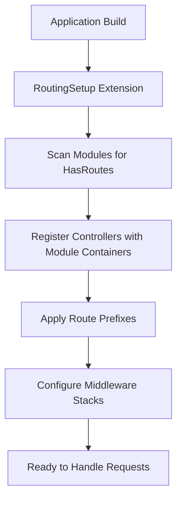
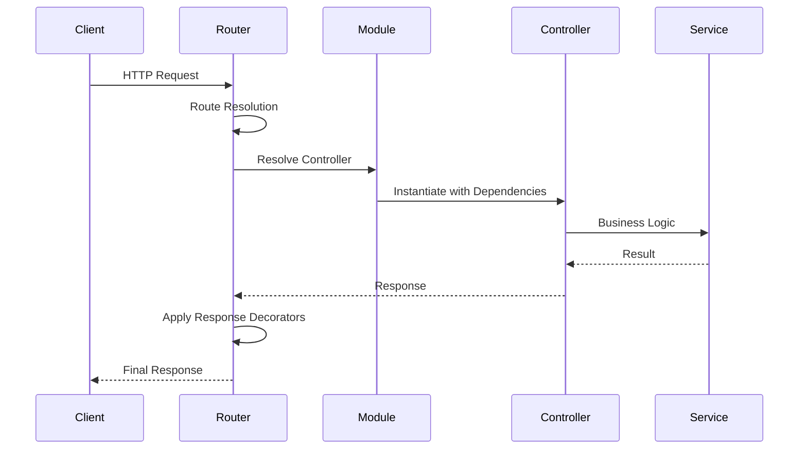

# Architecture Guide

Understanding the Modular Router's core architectural principles and how it integrates with the Power Modules framework.

## Core Philosophy

The Modular Router extends the Power Modules framework's principle of **explicit boundaries** to HTTP routing. Each module:

- Defines its own routes through the `HasRoutes` interface
- Maintains controller encapsulation within its own DI container
- Gets automatic route prefixing based on module name
- Can customize route prefixes and middleware stacks

This approach ensures that routing concerns remain properly encapsulated within modules while providing a unified HTTP interface for the entire application.

## Module-Centric Design

### Automatic Route Discovery

The router uses the framework's extension system to automatically discover and register routes without manual configuration:



This automatic discovery eliminates boilerplate while maintaining clear module boundaries.

### Route Organization Patterns

Routes are organized hierarchically by module ownership:

```
Application Routes
├── /user (UserModule)
│   ├── /profile
│   ├── /settings
│   └── /preferences
├── /admin (AdminModule)
│   ├── /dashboard
│   ├── /users
│   └── /reports
└── /api/v1 (ApiModule with custom prefix)
    ├── /users
    ├── /orders
    └── /health
```

This organization provides clear ownership and prevents route conflicts between modules.

## Dependency Injection Architecture

### Container Hierarchy

The router creates a layered container architecture that preserves module encapsulation:

```
Application Container
└── Router Container (internal)
    ├── RouterModule Services
    │   ├── ModularRouterInterface
    │   ├── League\Route\Router
    │   └── Strategy Configuration
    └── Controller Registrations
        ├── UserController → UserModule Container
        ├── AdminController → AdminModule Container
        └── ApiController → ApiModule Container
```

### Controller Resolution Strategy

Controllers are resolved using the **InstanceViaContainerResolver** pattern:

1. **Registration Phase**: Controllers are registered in the router's container with references to their originating module containers
2. **Resolution Phase**: When a request arrives, the controller is instantiated from its original module's container
3. **Dependency Injection**: The module container provides all required dependencies

This ensures that:
- Controllers access their module's private services
- Module boundaries are respected at runtime
- Dependencies are resolved from the correct context

### Middleware Resolution Chain

Middleware resolution follows a clear precedence hierarchy:

```
Request → Module Middleware → Route Middleware → Controller
                ↑                   ↑
          Module Container    Router Container
```

This design allows for:
- **Module-level concerns** (authentication, logging, CORS)
- **Route-specific concerns** (validation, rate limiting)
- **Flexible composition** of middleware stacks

## Request Lifecycle

The router integrates seamlessly with the Power Modules framework lifecycle:



### Framework Integration Points

1. **Module Registration**: Modules define their routing contracts through interfaces
2. **Setup Phase**: The `RoutingSetup` extension wires everything together
3. **Runtime Resolution**: Requests flow through the module system naturally
4. **Response Processing**: Global decorators provide cross-cutting concerns

## Design Principles

### Encapsulation First

Each module owns its routes, controllers, and dependencies completely:

- **Route Definitions**: Modules define their own URL structure
- **Controller Dependencies**: Resolved from module-specific containers
- **Middleware Stacks**: Module-level and route-level composition
- **Business Logic**: Contained within module boundaries

### Convention over Configuration

The router minimizes boilerplate through intelligent defaults:

- **Automatic Discovery**: No manual route registration required
- **Conventional Prefixing**: Module names become URL prefixes
- **Standard Contracts**: Simple interfaces for common patterns
- **Override Mechanisms**: Escape hatches for custom requirements

### Composition over Inheritance

Complex routing behavior emerges from simple, composable pieces:

- **Module Interfaces**: Single-purpose contracts (`HasRoutes`, `HasMiddleware`)
- **Middleware Stacking**: Layered concerns without coupling
- **Response Decorators**: Global transformations without modification
- **Strategy Pattern**: Pluggable routing strategies

## Architectural Benefits

### Team Scalability
- **Independent Development**: Modules can be developed in parallel
- **Clear Ownership**: Route ownership maps to team boundaries
- **Reduced Conflicts**: Module prefixes prevent route collisions
- **Easy Onboarding**: New developers understand boundaries quickly

### System Evolution
- **Incremental Changes**: Modify individual modules without affecting others
- **Feature Flags**: Enable/disable modules conditionally
- **API Versioning**: Multiple API modules can coexist
- **Migration Paths**: Legacy and new systems can run side-by-side

### Testing Strategy
- **Unit Testing**: Test modules in complete isolation
- **Integration Testing**: Verify module interactions through HTTP
- **Contract Testing**: Ensure interface compliance
- **End-to-End Testing**: Full request/response cycles

## Important Constraints

### Controller Class Uniqueness

**Critical Design Limitation**: Multiple modules cannot share the same controller class name.

**Why This Matters**:
- Controller classes are registered by class name as the container key
- Later registrations overwrite earlier ones
- Controllers will resolve from the wrong module's container

**Mitigation Strategies**:
- Use namespace-specific controller classes
- Adopt module-specific naming conventions
- Prefer composition over shared controller inheritance

### Module Loading Order

Module registration order can affect:
- Controller resolution (last wins for duplicate classes)
- Middleware precedence in some edge cases
- Configuration merging behavior

**Best Practice**: Keep modules independent and avoid relying on registration order.

## Extension Points

### Custom Strategies

Replace the default League/Route strategy for specialized behavior:
- JSON-first APIs
- GraphQL endpoints  
- Custom authentication flows
- Specialized error handling

### Response Decorators

Add global response transformations:
- CORS headers for browser APIs
- Security headers for all responses
- Performance tracking and metrics
- API versioning information

### Middleware Composition

Create sophisticated middleware stacks:
- Authentication and authorization
- Request/response logging
- Rate limiting and throttling
- Content negotiation

For detailed API documentation and implementation examples, see the [API Reference](api-reference.md).