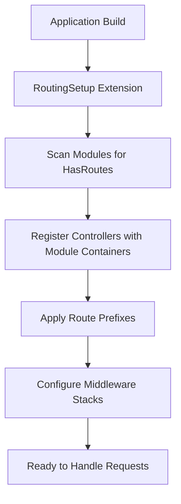
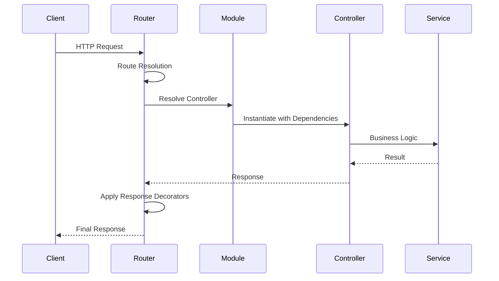

# Architecture Guide

Understanding the Modular Router's core architectural principles and how it integrates with the Power Modules framework.

## Core Philosophy

The Modular Router extends the Power Modules framework's principle of **explicit boundaries** to HTTP routing. Each module:

- Defines its own routes through the `HasRoutes` interface
- Maintains controller encapsulation within its own DI container
- Gets automatic route prefixing based on module name
- Can customize route prefixes and middleware stacks

This approach ensures that routing concerns remain properly encapsulated within modules while providing a unified HTTP interface for the entire application.

## Module-Centric Design

### Automatic Route Discovery

The router uses the framework's extension system to automatically discover and register routes without manual configuration:


```mermaid
flowchart TD
    A[Application Build] --> B[RoutingSetup Extension]
    B --> C[Scan Modules for HasRoutes]
    C --> D[Register Controllers with Module Containers]
    D --> E[Apply Route Prefixes]
    E --> F[Configure Middleware Stacks]
    F --> G[Ready to Handle Requests]
```

This automatic discovery eliminates boilerplate while maintaining clear module boundaries.

### Route Organization Patterns

Routes are organized hierarchically by module ownership:

```
Application Routes
├── /user (UserModule)
│   ├── /profile
│   ├── /settings
│   └── /preferences
├── /admin (AdminModule)
│   ├── /dashboard
│   ├── /users
│   └── /reports
└── /api/v1 (ApiModule with custom prefix)
    ├── /users
    ├── /orders
    └── /health
```

This organization provides clear ownership and prevents route conflicts between modules.

## Dependency Injection Architecture

### Container Hierarchy

The native router keeps router services in the application container while preserving per-module resolution for runtime request handling:

```
Application Container
├── RouterModule Services
│   ├── ModularRouterInterface
│   ├── RouteCompiler / RouteMatcher
│   └── Router Strategy Configuration
└── Module Containers
    ├── UserModule Container
    ├── AdminModule Container
    └── ApiModule Container
```

### Handler Resolution Strategy

Handlers are resolved from the originating module container during dispatch:

1. **Registration Phase**: Routes store the handler class plus its originating module container
2. **Resolution Phase**: When a request arrives, the handler is instantiated from its original module container
3. **Dependency Injection**: The module container provides all required dependencies

This ensures that:
- Handlers access their module's private services
- Module boundaries are respected at runtime
- Dependencies are resolved from the correct context

### Middleware Resolution Chain

Middleware resolution follows a clear precedence hierarchy:

```
Request → Module Middleware → Route Middleware → RequestHandlerInterface
```

This design allows for:
- **Module-level concerns** (authentication, logging, CORS)
- **Route-specific concerns** (validation, rate limiting)
- **Flexible composition** of middleware stacks

### Response Decorator Chain

Response decorators are applied in a predictable "inside-out" order after the handler generates a response, allowing for composable response transformations at multiple levels (global, module, and route).

For detailed information about decorator execution order and practical usage patterns, see the [Response Decorators section in Advanced Patterns](advanced-patterns.md#response-decorators).

### Native Execution Pipeline

The router now owns its runtime pipeline end to end and resolves middleware and handlers lazily from the matched module container at execution time.

**Registration Phase** (during bootstrap):
1. Store the fully resolved route path and method.
2. Record the originating module container.
3. Record ordered middleware, decorators, and placeholder metadata.

**Compilation Phase**:
1. Build per-method static route maps.
2. Build per-method dynamic tries for placeholder routes.
3. Record module prefixes for fast prefix partitioning.

**Execution Phase** (per request):
1. Match the request path against the compiled route table.
2. Resolve middleware classes from the matched route's module container.
3. Resolve the matched `RequestHandlerInterface` from the same module container.
4. Execute the explicit middleware pipeline, then apply decorators.

**Key Benefits**:
- **Performance**: Only the matched route's middleware and handler are resolved.
- **Explicit Semantics**: Matching, `HEAD`, `OPTIONS`, 404, and 405 behavior are router-owned.
- **Module Encapsulation**: Runtime resolution stays inside the originating module container.
- **Vendor Independence**: No League Route or FastRoute dispatcher behavior leaks into runtime.

## Request Lifecycle

The router integrates seamlessly with the Power Modules framework lifecycle:


```mermaid
sequenceDiagram
    participant Client
    participant Router
    participant Module
    participant Controller
    participant Service
    
    Client->>Router: HTTP Request
    Router->>Router: Route Resolution
    Router->>Module: Resolve Controller
    Module->>Controller: Instantiate with Dependencies
    Controller->>Service: Business Logic
    Service-->>Controller: Result
    Controller-->>Router: Response
    Router->>Router: Apply Response Decorators
    Router-->>Client: Final Response
```

### Framework Integration Points

1. **Module Registration**: Modules define their routing contracts through interfaces
2. **Setup Phase**: The `RoutingSetup` extension wires everything together
3. **Runtime Resolution**: Requests flow through the module system naturally
4. **Response Processing**: Global decorators provide cross-cutting concerns

## Design Principles

### Encapsulation First

Each module owns its routes, controllers, and dependencies completely:

- **Route Definitions**: Modules define their own URL structure
- **Controller Dependencies**: Resolved from module-specific containers
- **Middleware Stacks**: Module-level and route-level composition
- **Business Logic**: Contained within module boundaries

### Convention over Configuration

The router minimizes boilerplate through intelligent defaults:

- **Automatic Discovery**: No manual route registration required
- **Conventional Prefixing**: Module names become URL prefixes
- **Standard Contracts**: Simple interfaces for common patterns
- **Override Mechanisms**: Escape hatches for custom requirements

### Composition over Inheritance

Complex routing behavior emerges from simple, composable pieces:

- **Module Interfaces**: Single-purpose contracts (`HasRoutes`, `HasMiddleware`)
- **Middleware Stacking**: Layered concerns without coupling
- **Response Decorators**: Global transformations without modification
- **Strategy Pattern**: Pluggable routing strategies

## Architectural Benefits

### Team Scalability
- **Independent Development**: Modules can be developed in parallel
- **Clear Ownership**: Route ownership maps to team boundaries
- **Reduced Conflicts**: Module prefixes prevent route collisions
- **Easy Onboarding**: New developers understand boundaries quickly

### System Evolution
- **Incremental Changes**: Modify individual modules without affecting others
- **Feature Flags**: Enable/disable modules conditionally
- **API Versioning**: Multiple API modules can coexist
- **Migration Paths**: Legacy and new systems can run side-by-side

### Testing Strategy
- **Unit Testing**: Test modules in complete isolation
- **Integration Testing**: Verify module interactions through HTTP
- **Contract Testing**: Ensure interface compliance
- **End-to-End Testing**: Full request/response cycles

## Controller Resolution Strategy

### How Controllers Are Resolved

The router uses a sophisticated controller resolution strategy that maintains module encapsulation:

**Registration Process**:
1. Controllers are registered using their **fully qualified class name** (e.g., `App\User\UserController`)
2. Each controller registration includes a reference to its originating module's container
3. The `InstanceViaContainerResolver` handles resolution from the correct module container

**Resolution Process**:
1. When a request arrives, the router looks up the controller by its fully qualified class name
2. The `InstanceViaContainerResolver` receives the module container as the resolution context
3. The controller is instantiated from its originating module's container with proper dependencies

**Key Benefits**:
- **True Module Encapsulation**: Controllers access only their module's services
- **No Class Name Conflicts**: Different namespaces prevent collisions naturally
- **Proper Dependency Resolution**: Each controller gets dependencies from its own module
- **Container Isolation**: Modules cannot accidentally access other modules' private services

### Controller Sharing Patterns

**Namespace Separation (Recommended)**:
```php
// UserModule
App\User\UserController::class

// AdminModule  
App\Admin\UserController::class
```
These are completely separate classes despite similar names.

**Intentional Controller Sharing (Advanced)**:
```php
// Multiple modules can deliberately share the same controller class
App\Shared\HealthController::class
```
In this case, the last registered module's container will be used for resolution, which is usually acceptable for shared components.

### Module Loading Order

Module registration order has minimal impact:
- **Controller resolution**: Fully qualified names prevent conflicts
- **Middleware precedence**: Module middleware runs in registration order
- **Configuration merging**: Later modules can override earlier configuration

**Best Practice**: Design modules to be order-independent for maximum flexibility.

## Extension Points

The router's behavior can be customized through several key extension points, allowing for advanced and specialized use cases.

### Custom Strategies

Replace the default League/Route strategy to implement specialized behavior for your entire application. This is ideal for:
- JSON-first APIs
- GraphQL endpoints
- Custom authentication flows
- Specialized error handling

### Response Decorators

Add global, module-level, or route-level response transformations. This pattern is perfect for:
- Adding CORS headers for browser APIs
- Injecting security headers (e.g., `X-Frame-Options`, `Content-Security-Policy`)
- Tracking performance metrics and adding timing headers
- Implementing API versioning in headers

### Middleware Composition

Create sophisticated, layered middleware stacks to handle cross-cutting concerns like:
- Authentication and authorization
- Request/response logging
- Rate limiting and throttling
- Content negotiation

For detailed API documentation and implementation examples, see the [API Reference](api-reference.md) and [Advanced Patterns](advanced-patterns.md).